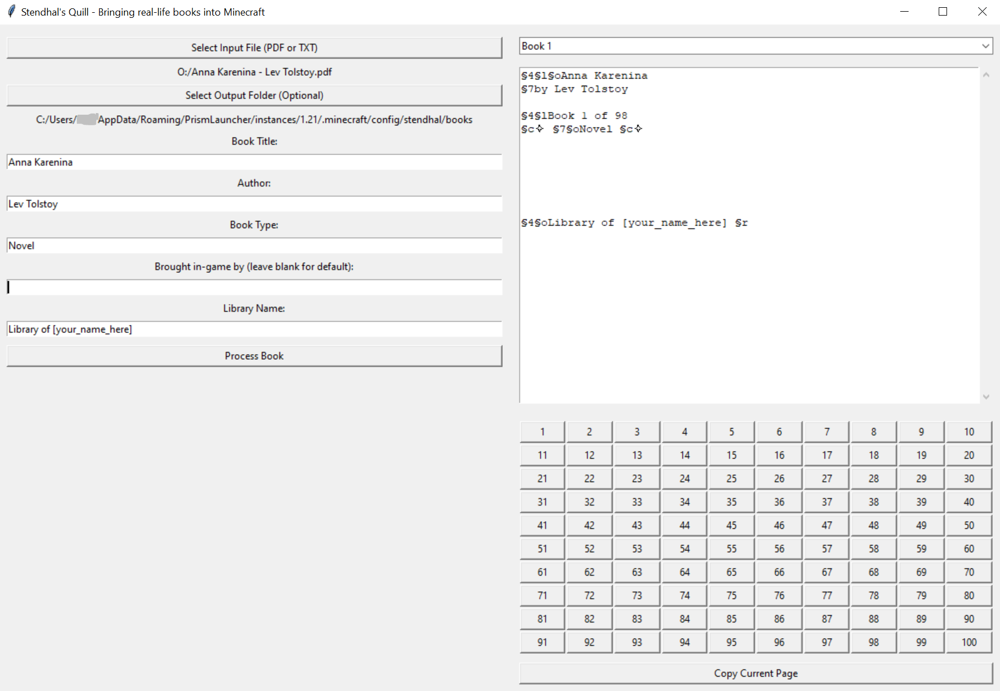
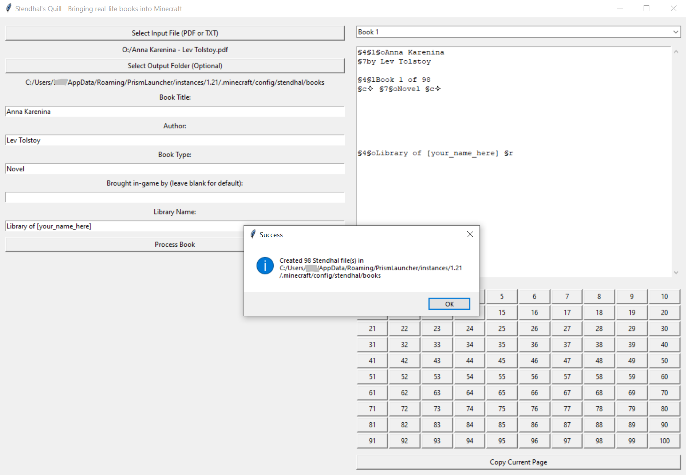
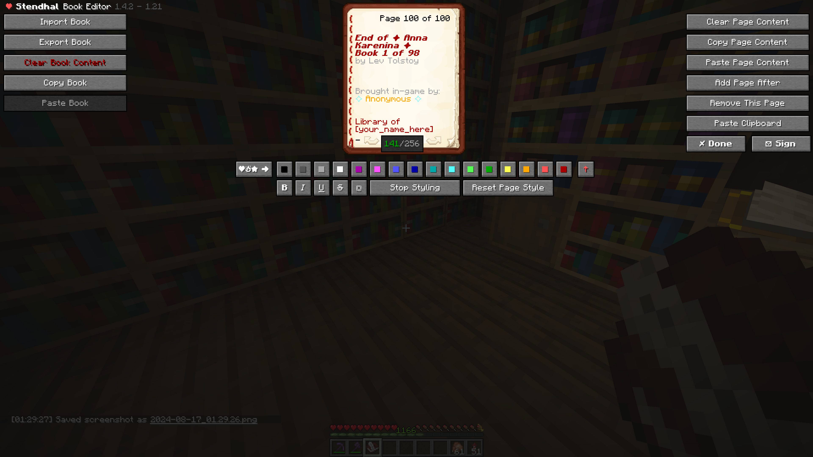

# Stendhal's Quill - Bringing real-life books into Minecraft

This is a Python application designed to process and format books (or big chunks of text) for use with the Stendhal mod in Minecraft.

## About Stendhal

[Stendhal](https://modrinth.com/mod/stendhal) Stendhal is a client-side Fabric mod offering new and enhanced visual utilities for books, signs, anvil and the in-game chat. This Python application helps in preparing content for use with Stendhal Mod by splitting large texts into Minecraft-friendly book formats.
Tested on: Stendhal 1.4.1 - Minecraft 1.21

## Features

- Process text files and PDFs into Minecraft Stendhal book format
- Split large texts into multiple books
- Add custom front, end and seal pages to each book
- GUI for easy interaction and book preview

## Environment Requirements

- Python 3.6+
- tkinter
- PyPDF2

## Minecraft Mods Required for the full process (of also importing the book easier)
- Stendhal Mod

## Installation

1. Clone this repository:
   ```
   git clone https://github.com/Lezzz/minecraft-stendhals-quill.git
   ```
2. Install the required dependencies:
   ```
   pip install PyPDF2
   ```

## Usage

1. Run the script:
   ```
   python3 stendhals_quill.py
   ```
2. Use the GUI to select your input file, set book details, and process the content.

3. The processed books will be saved in the selected output folder (or a default folder if none is selected - don't forget to set it inside the script!).

4. If you haven't selected the Stendhal books folder as Output folder, move the .stendhal files to ' .minecraft\config\stendhal\books ' 
5. Import the books in-game using the Stendhal Mod and sign.




## Contributing

Contributions are welcome! Please feel free to submit a Pull Request.

## License

This project is licensed under the MIT License - see the [LICENSE](LICENSE) file for details.

## Acknowledgments

- Thanks to the Stendhal mod creators for inspiring this project and allowing the difficult part of importing whole books.
- Special thanks to UltraVanilla Minecraft server for letting me test this tool in a live environment and in a long-standing community.
